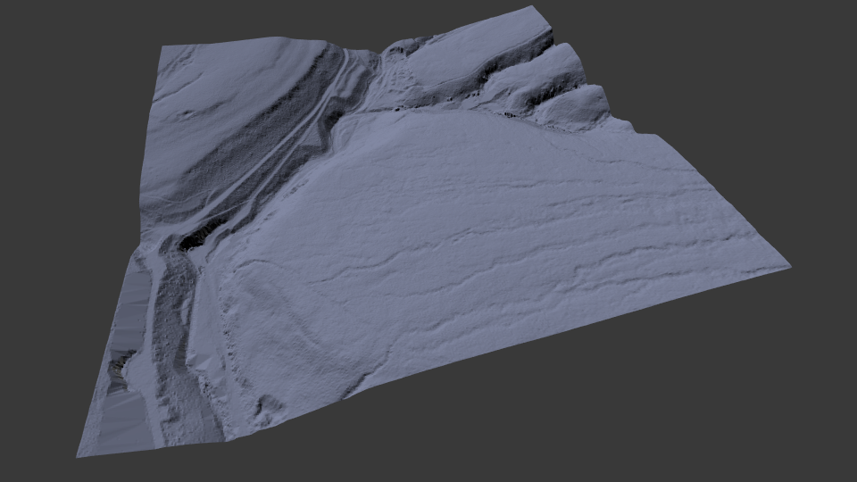

# Import ESRI ASCII Format (.asc)

This addon allows you to import raster data stored using the
[ESRI ASCII format](http://resources.esri.com/help/9.3/arcgisdesktop/com/gp_toolref/spatial_analyst_tools/esri_ascii_raster_format.htm)
into Blender to create a new mesh object. This data format is commonly used to
encode LIDAR or other topology data and usually has the extension `.asc`.

## Features
- correctly supports files both with and without a `NODATA_value` declaration
- can read files which specify either `XLLCENTER` or `XLLCORNER`. The associated values are, however, currently ignored and the mesh is always positioned with the lower left corner at (0, 0, 0).
- allows the mesh to be scaled on import to avoid huge meshes being produced. The default is set to 0.01 so that a 1km square LIDAR image becomes a 10x10 sized mesh
- missing values are treated as being at sea level (i.e. the vertex is set to 0)

## Credits

Thanks go to [zeffii](https://github.com/zeffii) who wrote a [similar script](https://gist.github.com/zeffii/5dc7dd44899b7ae36dab73a2c235cd4f#file-modified_original_with_skipping_whitespace-py)
which I used as inspiration for this addon.
